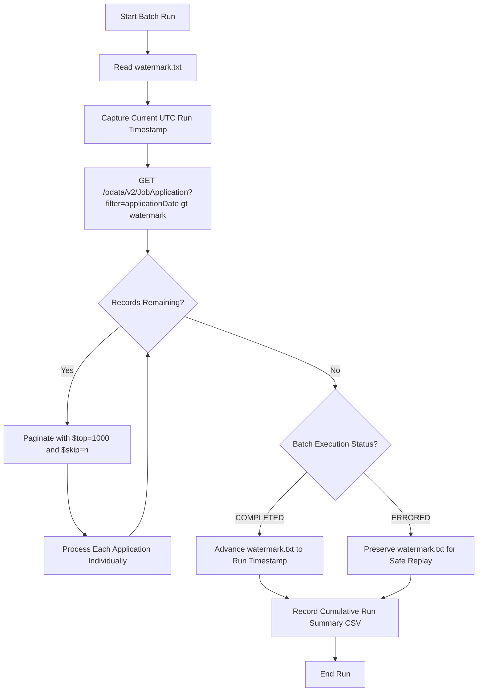
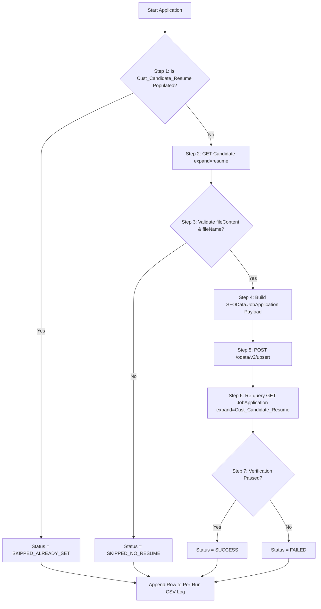

# SAP SuccessFactors Recruiting Resume Shifter

[](https://www.python.org/downloads/)
[](https://opensource.org/licenses/MIT)
[](https://help.sap.com/)

**SAP SuccessFactors Recruiting Resume Shifter** is a production-ready, enterprise-grade Python integration service designed to copy Candidate Profile resumes (`Candidate.resume`) directly into Job Application custom attachment fields (`JobApplication.Cust_Candidate_Resume`), strictly enforcing the **WRITE-ONCE** historical snapshot business rule.

---

## 📑 Table of Contents

- [Business Context & Rules](#-business-context--rules)
- [System Architecture](#-system-architecture)
  - [Direct OData Upsert Design](#direct-odata-upsert-design)
  - [Batch Synchronization Flow](#batch-synchronization-flow)
  - [Per-Application 7-Step Pipeline](#per-application-7-step-pipeline)
- [Project Directory Structure](#-project-directory-structure)
- [Authentication & Security](#-authentication--security)
- [Installation & Setup](#-installation--setup)
- [Configuration Reference](#-configuration-reference)
- [CLI Operational Guide & Examples](#-cli-operational-guide--examples)
- [Watermark Management & Replay Safety](#-watermark-management--replay-safety)
- [Audit Logging & CSV Reports](#-audit-logging--csv-reports)
- [Automated Testing](#-automated-testing)
- [Production Deployment & Scheduling](#-production-deployment--scheduling)
- [Troubleshooting & FAQ](#-troubleshooting--faq)

---

## 📌 Business Context & Rules

In SAP SuccessFactors Recruiting Management (RCM), candidates frequently update their profile resumes over time. However, compliance, legal auditing, and recruiter workflows require that the resume attached to a specific **Job Application** represents the exact frozen historical snapshot of what the candidate had at the time of application.

### 🔄 Field Mapping
- **Source Field**: `Candidate.resume` (Attachment object on Candidate Profile)
- **Target Field**: `JobApplication.Cust_Candidate_Resume` (Custom Attachment field on Job Application)

### 🛡️ Strict Write-Once Rule
- **If `Cust_Candidate_Resume` is empty**:
  Copy the current Candidate Profile resume into the Job Application.
- **If `Cust_Candidate_Resume` already contains a value**:
  **Do NOT modify, overwrite, or replace it.** The existing document is frozen forever.

#### 📅 Example Scenario:
```
Day 1:
  Candidate Resume = Resume_A.pdf
  Application 1001 = empty
  → Integration runs: Copies Resume_A.pdf into Application 1001

Day 10:
  Candidate updates profile resume to Resume_B.pdf
  → Integration runs: Detects existing snapshot in Application 1001
  → Status = SKIPPED_ALREADY_SET
  → Application 1001 remains Resume_A.pdf forever.
```

---

## 🏛️ System Architecture

### Direct OData Upsert Design
As per enterprise integration standards, this application **does NOT create standalone Attachment entities** or call separate Attachment creation endpoints. Instead, it embeds the `Cust_Candidate_Resume` attachment object directly into the `JobApplication` entity payload sent to `POST /odata/v2/upsert`:

```json
{
  "__metadata": {
    "uri": "JobApplication(547994)",
    "type": "SFOData.JobApplication"
  },
  "applicationId": "547994",
  "Cust_Candidate_Resume": {
    "__metadata": {
      "type": "SFOData.Attachment"
    },
    "fileContent": "<BASE64_ENCODED_CONTENT>",
    "fileName": "Consultant - Consulting.pdf",
    "module": "RECRUITING"
  }
}
```

---

### Batch Synchronization Flow



---

### Per-Application 7-Step Pipeline



---

## 📂 Project Directory Structure

```
SF_Resume_Shifter/
├── client/                     # SAP SuccessFactors OData Client & Security
│   ├── __init__.py             # Client package exports
│   ├── auth.py                 # OAuth 2.0 SAML Bearer & Basic Auth providers
│   ├── exceptions.py           # Structured exception hierarchy
│   └── odata_client.py         # Resilient OData client with retries, backoff, and pagination
├── config/                     # Configuration Management
│   ├── __init__.py             # Configuration exports
│   └── settings.py             # Pydantic Settings with env parsing and secret redaction
├── core/                       # Core Business Logic & Orchestration
│   ├── __init__.py             # Core package exports
│   ├── engine.py               # Enterprise Batch Engine ($top/$skip, metrics, watermark)
│   ├── models.py               # Pydantic models (JobApplication, CandidateResume, Results)
│   ├── processor.py            # 7-Step single application pipeline enforcing Write-Once rule
│   └── watermark.py            # Watermark state manager with atomic file persistence
├── logging_utils/              # Structured Logging & CSV Reporting
│   ├── __init__.py             # Logger exports
│   ├── csv_logger.py           # Per-run CSV and Cumulative Summary CSV writers
│   └── logger.py               # Console/file logger with secret masking filters
├── tests/                      # Comprehensive Unit & Integration Test Suite
│   ├── __init__.py             # Test package
│   ├── mock_sf_server.py       # In-memory mock SAP SF OData server
│   ├── test_auth.py            # SAML 2.0 assertion signing and Basic Auth tests
│   ├── test_csv_logger.py      # CSV header and format validation tests
│   ├── test_engine.py          # Batch discovery pagination and error replay tests
│   ├── test_odata_wire.py      # Wire-level HTTP tests with mock responses
│   ├── test_processor.py       # Write-once, skipped, and failure scenario tests
│   └── test_watermark.py       # Atomic watermark persistence tests
├── logs/                       # Target directory for per-run execution CSV logs
├── watermark.txt               # Default watermark timestamp storage
├── resume_snapshot_run_summary.csv # Cumulative run summary CSV
├── main.py                     # CLI entrypoint supporting all operational modes
├── requirements.txt            # Python dependencies
├── .env.example                # Configuration template
├── .gitignore                  # Git exclusions for secrets and caches
└── README.md                   # Complete architectural documentation
```

---

## 🔐 Authentication & Security

The integration supports two authentication methods configured via `AUTH_TYPE`:

### 1. OAuth 2.0 SAML 2.0 Bearer Assertion (Recommended for Production)
Conforms to SAP SuccessFactors standard OAuth flow:
1. Generates an RFC 7522 SAML 2.0 Assertion with `<saml2:Issuer>`, `<saml2:Subject>`, and `<saml2:Conditions>`.
2. Cryptographically signs the assertion using **RSA-SHA256** with an X.509 private key.
3. Exchanges the assertion at `/oauth/token` for a bearer access token.
4. Caches the token with proactive refresh buffers and handles HTTP 401 retry cycles.

### 2. Basic Authentication (`user@company:password`)
Useful for sandbox and initial development. Encodes credentials as standard HTTP Basic headers.

---

## 🚀 Installation & Setup

### 1. Clone the Repository
```bash
git clone https://github.com/vanshaj8/SF_Resume_Shifter.git
cd SF_Resume_Shifter
```

### 2. Set Up Virtual Environment & Dependencies
```bash
python3 -m venv venv
source venv/bin/activate
pip install -r requirements.txt
```

### 3. Configure `.env`
Create `.env` by copying `.env.example`:
```bash
cp .env.example .env
```

Edit `.env` with your SuccessFactors tenant details:
```ini
SF_API_BASE_URL=https://api44preview.sapsf.com/odata/v2
SF_COMPANY_ID=YOUR_COMPANY_ID
AUTH_TYPE=basic
SF_USERNAME=apircmuser
SF_PASSWORD=YourPassword123
```

---

## ⚙️ Configuration Reference

All settings can be configured via environment variables or `.env` file:

| Variable | Type | Default | Description |
|---|---|---|---|
| `SF_API_BASE_URL` | String | `https://api12preview.sapsf.eu/odata/v2` | Base URL for SuccessFactors OData v2 API |
| `SF_COMPANY_ID` | String | `SF_CORP_DEMO` | SAP SuccessFactors Company / Tenant ID |
| `AUTH_TYPE` | String | `oauth2_saml` | Auth method: `oauth2_saml`, `basic`, or `mock` |
| `SF_CLIENT_ID` | String | `None` | OAuth2 Client API Key from SF Security Center |
| `SF_USER_ID` | String | `None` | Technical Integration User ID |
| `SF_TOKEN_URL` | String | `None` | OAuth token endpoint (auto-derived if empty) |
| `SF_PRIVATE_KEY_PATH` | Path | `None` | Path to RSA private key PEM file for SAML flow |
| `SF_USERNAME` | String | `None` | Basic Auth technical username |
| `SF_PASSWORD` | String | `None` | Basic Auth password |
| `BATCH_TOP` | Integer | `1000` | Records per `$top` OData pagination page (max 1000) |
| `REQUEST_TIMEOUT_SECONDS` | Integer | `60` | HTTP request timeout in seconds |
| `MAX_RETRIES` | Integer | `3` | Maximum retry attempts for transient errors (429, 5xx) |
| `BACKOFF_FACTOR` | Float | `1.0` | Exponential backoff factor for retries |
| `RATE_LIMIT_PAUSE_SECONDS` | Float | `0.05` | Pause between individual applications |
| `WATERMARK_FILE_PATH` | Path | `watermark.txt` | File path for persistent watermark state |
| `LOGS_DIR` | Path | `logs` | Directory for per-run CSV and application logs |
| `SUMMARY_CSV_PATH` | Path | `resume_snapshot_run_summary.csv` | Cumulative summary CSV file path |
| `LOG_LEVEL` | String | `INFO` | Logging level (`DEBUG`, `INFO`, `WARNING`, `ERROR`) |

---

## 💻 CLI Operational Guide & Examples

### 1. Single Application Mode
Test or synchronize a specific Job Application by ID:
```bash
python main.py --single 547998
```
*Output:*
```log
[INFO] [ResumeShifter.BatchEngine] Executing SINGLE APPLICATION mode for applicationId: 547998
[INFO] [ResumeShifter.Processor] --- Processing Application ID: 547998 | Candidate ID: 1104911 ---
[INFO] [ResumeShifter.Processor] [Step 3] Found valid candidate resume: 'Consultant - Consulting.pdf' (module=RECRUITING, size_b64=138598 bytes).
[INFO] [ResumeShifter.Processor] [Step 5] Upserting resume 'Consultant - Consulting.pdf' directly into JobApplication 547998 Cust_Candidate_Resume...
[INFO] [ResumeShifter.Processor] [Step 6] Verification passed for application 547998 (Attachment ID: 1516879, File: 'Consultant - Consulting.pdf').
[INFO] [ResumeShifter.Processor] [Step 7] Result: SUCCESS for Application 547998
```

---

### 2. Scheduled Batch Synchronization
Runs synchronization for all applications submitted after the stored watermark:
```bash
python main.py --batch
```
*Advances `watermark.txt` automatically upon successful completion.*

---

### 3. Dry-Run Mode (Simulation)
Inspects candidates and simulates upserts without writing changes to SuccessFactors or advancing the watermark:
```bash
python main.py --batch --dry-run
```

---

### 4. Custom Starting Date / Replay Mode
Run batch synchronization starting from a specific ISO-8601 timestamp:
```bash
python main.py --batch --since "2026-08-01T00:00:00Z"
```

---

### 5. Force Mode (Testing / Admin Override)
Bypasses the Step 1 Write-Once guard to force an update on a specific application:
```bash
python main.py --single 547998 --force
```

---

### 6. Watermark State Inspection & Management
```bash
# Display currently stored watermark
python main.py --get-watermark

# Reset watermark to a specific timestamp
python main.py --reset-watermark "2026-08-01T00:00:00Z"

# Clear watermark (next run will perform initial full sync)
python main.py --reset-watermark clear
```

---

### 7. Offline Simulation Mode (Mock Server)
Run the application against the built-in mock SuccessFactors database without any network credentials:
```bash
# Single application mock
python main.py --single 1001 --mock

# Full batch mock run
python main.py --batch --mock
```

---

## ⏱️ Watermark Management & Replay Safety

The synchronization engine implements strict watermark safety to guarantee **zero data loss** and **replay capability**:

1. **At Run Start**: The engine reads the timestamp from `watermark.txt` and captures the current UTC run timestamp.
2. **On `COMPLETED` Status**: `watermark.txt` is updated atomically to the run timestamp.
3. **On `ERRORED` Status**: If a fatal network or database failure occurs, the watermark is **PRESERVED** at its previous value. This allows the scheduled job to automatically replay from where it left off without skipping records.

```
Run 1 (09:00 UTC) -> Status: COMPLETED -> watermark.txt = 2026-08-25T09:00:00Z
Run 2 (10:00 UTC) -> Status: ERRORED   -> watermark.txt = 2026-08-25T09:00:00Z (Preserved)
Run 3 (11:00 UTC) -> Status: COMPLETED -> watermark.txt = 2026-08-25T11:00:00Z (Replayed & Advanced)
```

---

## 📊 Audit Logging & CSV Reports

### 1. Per-Run CSV Log
Stored in `logs/resume_snapshot_log_<timestamp>.csv` for every execution:

| Column | Description | Example |
|---|---|---|
| `runTimestamp` | Execution timestamp (ISO-8601 UTC) | `2026-08-25T10:30:43Z` |
| `applicationId` | JobApplication ID | `547998` |
| `candidateId` | Candidate ID | `1104911` |
| `status` | Execution status | `SUCCESS`, `SKIPPED_ALREADY_SET`, `SKIPPED_NO_RESUME`, `FAILED` |
| `attachmentPresent` | `true` if attachment exists post-run | `true` |
| `errorMessage` | Error message or skip rationale | `Candidate profile does not contain a valid resume attachment.` |

#### Sample Per-Run CSV:
```csv
runTimestamp,applicationId,candidateId,status,attachmentPresent,errorMessage
2026-08-25T10:30:43Z,547998,1104911,SUCCESS,true,
2026-08-25T10:30:54Z,547998,1104911,SKIPPED_ALREADY_SET,true,
```

---

### 2. Cumulative Run Summary CSV
Stored in `resume_snapshot_run_summary.csv` tracking historical batch statistics:

| Column | Description | Example |
|---|---|---|
| `runTimestamp` | Batch run start timestamp | `2026-08-25T10:30:43Z` |
| `applicationsFound` | Total applications retrieved in batch | `42` |
| `succeeded` | Resumes successfully copied | `38` |
| `skippedAlreadySet` | Applications skipped by Write-Once guard | `3` |
| `skippedNoResume` | Candidates with no resume | `1` |
| `failed` | Processing failures | `0` |
| `runStatus` | Overall batch status | `COMPLETED` or `ERRORED` |

---

## 🧪 Automated Testing

The repository includes a comprehensive test suite with 24 tests covering unit, mock, and wire-level HTTP protocol scenarios.

Run the test suite:
```bash
pytest -v tests/
```

### Test Coverage Highlights:
- **Write-Once Enforcement**: Validates Day 1 copy and ensures Day 10 profile updates are blocked.
- **Wire Protocol & Headers**: Tests HTTP request/response payloads, `DataServiceVersion: 2.0`, and OData date formatting.
- **Token Refresh**: Tests 401 Unauthorized handling and automatic token renewal.
- **Pagination**: Tests multi-page `$top=1000` / `$skip=n` loops.
- **Watermark Atomic Writes**: Validates atomic replacement and error preservation.

---

## ⏰ Production Deployment & Scheduling

### Option 1: Linux Crontab (Hourly Batch Sync)
Add the following entry to your crontab (`crontab -e`):
```cron
# Run SuccessFactors Resume Shifter at minute 0 of every hour
0 * * * * cd /opt/SF_Resume_Shifter && /opt/SF_Resume_Shifter/venv/bin/python main.py --batch >> /opt/SF_Resume_Shifter/logs/cron.log 2>&1
```

### Option 2: Systemd Service & Timer
Create `/etc/systemd/system/sf-resume-shifter.service`:
```ini
[Unit]
Description=SAP SuccessFactors Recruiting Resume Shifter
After=network.target

[Service]
Type=oneshot
User=sfapp
WorkingDirectory=/opt/SF_Resume_Shifter
ExecStart=/opt/SF_Resume_Shifter/venv/bin/python main.py --batch
StandardOutput=append:/opt/SF_Resume_Shifter/logs/service.log
StandardError=append:/opt/SF_Resume_Shifter/logs/service.log
```

Create `/etc/systemd/system/sf-resume-shifter.timer`:
```ini
[Unit]
Description=Hourly trigger for SAP SuccessFactors Resume Shifter

[Timer]
OnCalendar=hourly
Persistent=true

[Install]
WantedBy=timers.target
```

Enable and start the timer:
```bash
sudo systemctl daemon-reload
sudo systemctl enable --now sf-resume-shifter.timer
```

---

## ❓ Troubleshooting & FAQ

#### 1. Error: `entity type is NOT allowed to be null or empty`
- **Cause**: SuccessFactors OData v2 upsert requires the `uri` property in `__metadata`.
- **Solution**: The engine automatically attaches `"uri": f"JobApplication({application_id})"` to the `__metadata` payload.

#### 2. Candidate Resume is Skipped (`SKIPPED_NO_RESUME`)
- **Cause**: The candidate has not uploaded a resume attachment to their candidate profile or `fileContent` is empty.
- **Action**: Check `Candidate(<candidateId>)?$expand=resume` in SuccessFactors.

#### 3. How to re-run applications for a previous date range?
- Use the `--since` flag:
  ```bash
  python main.py --batch --since "2026-08-01T00:00:00Z"
  ```
- Any application that already has a resume will be safely skipped (`SKIPPED_ALREADY_SET`), and only empty applications will be populated.

---

## 📄 License

This project is licensed under the MIT License.
