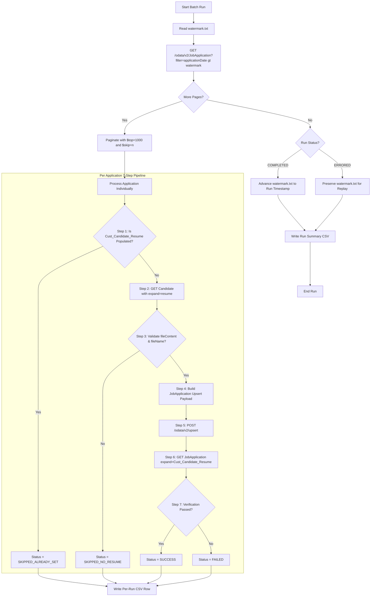

# SAP SuccessFactors Recruiting Resume Shifter

Enterprise-grade, production-ready Python integration that copies a Candidate Profile resume (`Candidate.resume`) into a Job Application custom attachment field (`JobApplication.Cust_Candidate_Resume`), enforcing the strict **WRITE-ONCE** historical snapshot business rule.

---

## 📌 Business Requirement & Rule

When candidates apply for jobs, their profile resume at the time of application must be preserved forever as a frozen historical snapshot on the application record.

### 🛡️ Write-Once Rule
- **If `JobApplication.Cust_Candidate_Resume` is empty**:
  Copy the current Candidate Profile resume (`Candidate.resume`) directly into the Job Application.
- **If `JobApplication.Cust_Candidate_Resume` already contains a value**:
  Do **NOT** modify, overwrite, or replace it.

#### 📅 Example Timeline:
```
Day 1:
  Candidate Resume = Resume_A.pdf
  Application 1001 = empty
  → System copies Resume_A.pdf into Application 1001

Day 10:
  Candidate updates profile resume = Resume_B.pdf
  → Application 1001 remains Resume_A.pdf forever.
```

---

## 🏛️ Architecture & Data Flow



### ⚡ Direct Upsert Payload (No Attachment API calls)
As required by the architecture specification, this application does **not** call separate Attachment creation APIs. It embeds the `Cust_Candidate_Resume` attachment object directly into `POST /odata/v2/upsert`:

```json
{
  "__metadata": {
    "type": "SFOData.JobApplication"
  },
  "applicationId": "1001",
  "Cust_Candidate_Resume": {
    "__metadata": {
      "type": "SFOData.Attachment"
    },
    "fileContent": "<BASE64_CONTENT>",
    "fileName": "Resume_A.pdf",
    "module": "RECRUITING"
  }
}
```

---

## 📂 Project Directory Structure

```
Resume_Shifter/
├── client/                     # SAP SF OData v2 Client & Authentication
│   ├── auth.py                 # OAuth 2.0 SAML Bearer & Basic Auth handlers
│   ├── exceptions.py           # Structured exception hierarchy
│   └── odata_client.py         # Resilient OData client with retries, backoff, and pagination
├── config/                     # Configuration Management
│   └── settings.py             # Pydantic Settings with env parsing and secret redaction
├── core/                       # Business Logic & Orchestration Engine
│   ├── engine.py               # Enterprise Batch Engine ($top/$skip, metrics, watermark commits)
│   ├── models.py               # Pydantic models (JobApplication, CandidateResume, ProcessResult)
│   ├── processor.py            # 7-Step single application pipeline enforcing Write-Once rule
│   └── watermark.py            # Watermark state manager with atomic writes & replay safety
├── logging_utils/              # Structured Logging & CSV Audit Loggers
│   ├── csv_logger.py           # Per-run CSV and Cumulative Summary CSV writers
│   └── logger.py               # Console/file logger with secret masking filters
├── tests/                      # Comprehensive Unit & Integration Test Suite
│   ├── mock_sf_server.py       # In-memory mock SAP SF OData server
│   ├── test_auth.py            # SAML 2.0 and Basic Auth tests
│   ├── test_csv_logger.py      # CSV header & row format validation
│   ├── test_engine.py          # Batch pagination and error replay tests
│   ├── test_odata_wire.py      # Wire-level HTTP tests with responses
│   ├── test_processor.py       # Write-once, skipped, and failure scenario tests
│   └── test_watermark.py       # Atomic watermark persistence tests
├── logs/                       # Target directory for execution CSV logs
├── watermark.txt               # Default watermark timestamp storage
├── resume_snapshot_run_summary.csv # Cumulative summary CSV
├── main.py                     # CLI entrypoint supporting all operational modes
├── requirements.txt            # Python dependencies
└── .env.example                # Configuration template
```

---

## 🚀 Quickstart & Installation

### 1. Install Dependencies
```bash
python3 -m pip install -r requirements.txt
```

### 2. Configure Environment
Copy `.env.example` to `.env` and configure your SAP SuccessFactors credentials:
```bash
cp .env.example .env
```

Key environment variables:
- `SF_API_BASE_URL`: Base URL (e.g. `https://api12preview.sapsf.eu/odata/v2`)
- `SF_COMPANY_ID`: Tenant / Company ID
- `AUTH_TYPE`: `oauth2_saml` (recommended) or `basic`
- `SF_CLIENT_ID`: OAuth2 Client Application Key
- `SF_USER_ID`: Integration technical user with Recruiting OData permissions
- `SF_PRIVATE_KEY_PATH`: Path to RSA private key file for SAML assertions

---

## 💻 CLI Usage Guide

### Mode 1: Single Application Mode
Test or sync a single application by ID:
```bash
python main.py --single 1001
```

### Mode 2: Scheduled Batch Run
Executes the batch run using the watermark in `watermark.txt`. Advances watermark upon completion:
```bash
python main.py --batch
```

### Mode 3: Dry-Run Simulation
Inspects candidates and simulates upserts without modifying SuccessFactors or advancing the watermark:
```bash
python main.py --batch --dry-run
```

### Mode 4: Custom Timestamp Batch (Replay)
Run for all applications submitted after a specific timestamp:
```bash
python main.py --batch --since "2026-08-01T00:00:00Z"
```

### Mode 5: Inspect Current Watermark
```bash
python main.py --get-watermark
```

### Mode 6: Reset / Clear Watermark
```bash
# Set watermark to specific date
python main.py --reset-watermark "2026-08-01T00:00:00Z"

# Clear watermark (next run will process all records)
python main.py --reset-watermark clear
```

### Mode 7: Offline Mock Testing
Run against the built-in mock SuccessFactors engine:
```bash
# Single application mock
python main.py --single 1001 --mock

# Batch mock run
python main.py --batch --mock
```

---

## 📊 CSV Audit Logging

### 1. Per-Run CSV Log
Generated in `logs/resume_snapshot_log_<timestamp>.csv`:
| Column | Description |
|---|---|
| `runTimestamp` | Execution timestamp (ISO-8601 UTC) |
| `applicationId` | JobApplication ID |
| `candidateId` | Candidate ID |
| `status` | `SUCCESS`, `SKIPPED_ALREADY_SET`, `SKIPPED_NO_RESUME`, `FAILED` |
| `attachmentPresent` | `true` if attachment exists post-execution |
| `errorMessage` | Error details if failed, or skip explanation |

### 2. Cumulative Run Summary CSV
Maintained in `resume_snapshot_run_summary.csv`:
| Column | Description |
|---|---|
| `runTimestamp` | Batch execution timestamp |
| `applicationsFound` | Total applications discovered in this batch |
| `succeeded` | Count of successfully copied resumes |
| `skippedAlreadySet` | Count skipped because target was already populated (Write-Once) |
| `skippedNoResume` | Count skipped because candidate profile had no resume |
| `failed` | Count of failures |
| `runStatus` | `COMPLETED` or `ERRORED` |

---

## 🧪 Running Automated Tests

Run the full pytest suite (24 tests covering auth, engine, processor, wire protocol, and watermark):
```bash
pytest -v tests/
```
